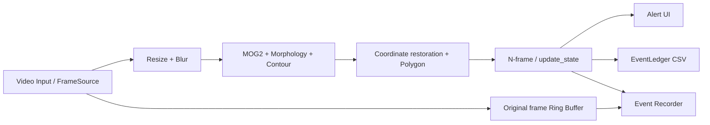
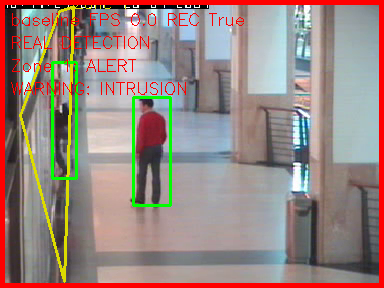
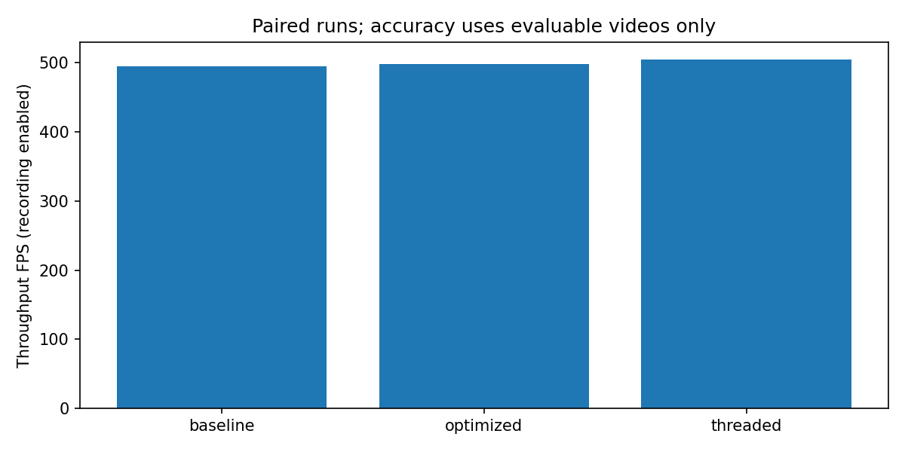
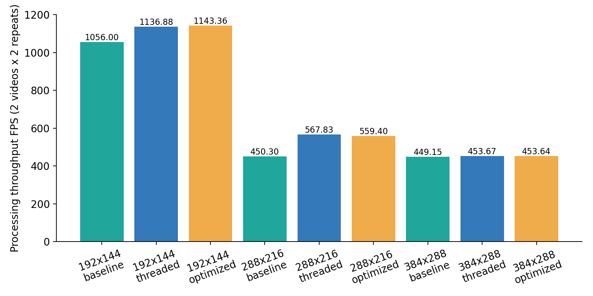
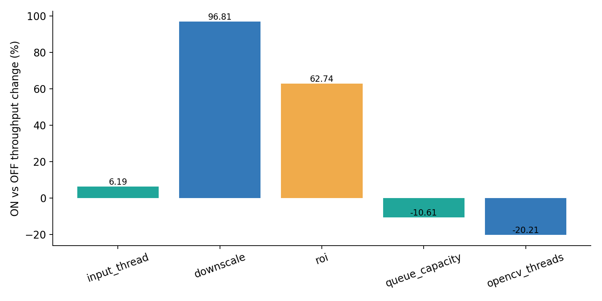
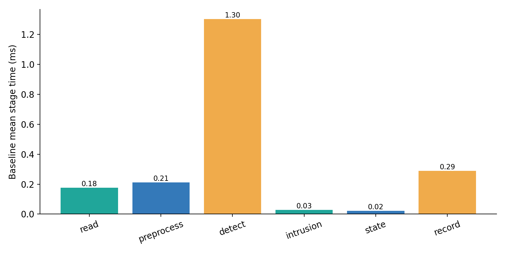

# OpenCV 위험구역 침입 감지 및 실시간 처리 최적화 — 최종 프로젝트 보고서

## 1. 프로젝트 개요

수동 CCTV 관찰 부담을 줄이기 위해 사용자가 지정한 위험구역에서 움직임 기반 침입을 감지하고 경보·사건 영상을 저장한다. 목표는 OpenCV 감지부터 사건 증거·정량 평가까지 연결하고, 실제 입력에서 처리 구조와 최적화의 효과 및 손실을 검증하는 것이다. 객체 종류/신원 식별 시스템은 아니다.

## 2. 요구사항 대비 구현 결과

상태는 실제 코드 기준이다. `EXPERIMENTAL / CONFIGURED`는 정식 기본 경로와 구별한다. 세부 파일·클래스·필요성은 [구현 분석](implementation_analysis.md)에 있다.

| 기능 | 계획 | 최종구현 | 검증 |
| --- | --- | --- | --- |
| 마우스 Polygon | 최초 요구사항 | IMPLEMENTED | test_editor_keys_without_real_gui / test_json_and_display_coordinates |
| Polygon JSON 저장/불러오기 | 최초 요구사항 | IMPLEMENTED | test_editor_keys_without_real_gui / test_json_and_display_coordinates |
| 움직임 검출 | 최초 요구사항 | IMPLEMENTED | test_real_three_modes_csv_and_recording |
| 위험구역 내부 판정 | 최초 요구사항 | IMPLEMENTED | test_common_a_adapter_roi_coordinates |
| N-frame 연속 감지 | 최초 요구사항 | IMPLEMENTED | test_reentry_immediately_after_cleared / test_backend_default_threshold_and_warning |
| 상태 전환 | 최초 요구사항 | IMPLEMENTED | test_reentry_immediately_after_cleared / test_backend_default_threshold_and_warning |
| 현재 상태 Overlay | 최초 요구사항 | IMPLEMENTED | test_backend_default_threshold_and_warning |
| 빨간 경보 테두리 | 최초 요구사항 | IMPLEMENTED | test_backend_default_threshold_and_warning |
| 경고 문구 | 최초 요구사항 | IMPLEMENTED | test_backend_default_threshold_and_warning |
| 사건 영상 자동 저장 | 최초 요구사항 | IMPLEMENTED | test_three_second_buffer / test_event_file_and_long_extension |
| 사건 이전 3초 | 최초 요구사항 | IMPLEMENTED | test_three_second_buffer / test_event_file_and_long_extension |
| 사건 종료 이후 5초 | 최초 요구사항 | IMPLEMENTED | test_three_second_buffer / test_event_file_and_long_extension |
| 사건 CSV | 최초 요구사항 | IMPLEMENTED | test_ledger_concurrent_dedup / test_real_three_modes_csv_and_recording |
| 사건 시각 | 최초 요구사항 | IMPLEMENTED | test_ledger_concurrent_dedup / test_real_three_modes_csv_and_recording |
| 지속시간 | 최초 요구사항 | IMPLEMENTED | test_ledger_concurrent_dedup / test_real_three_modes_csv_and_recording |
| Zone 이름 | 최초 요구사항 | IMPLEMENTED | test_ledger_concurrent_dedup / test_real_three_modes_csv_and_recording |
| Optical Flow 방향/속도 | 최초 요구사항 | NOT IMPLEMENTED | 미검증; 향후 과제 |
| 빠른 접근 경고 | 최초 요구사항 | NOT IMPLEMENTED | 미검증; 향후 과제 |
| 주의/금지 단계 | 최초 요구사항 | NOT IMPLEMENTED | 미검증; 향후 과제 |
| 여러 Polygon Zone | 최초 요구사항 | IMPLEMENTED | test_ledger_concurrent_dedup / test_independent_duplicate_events_and_close |
| 침입 Heatmap | 최초 요구사항 | NOT IMPLEMENTED | 미검증; 최종 GT 영상만으로 효과 검증 불충분 |
| CLAHE | 최초 요구사항 | NOT IMPLEMENTED | 미검증; 최종 GT 영상만으로 효과 검증 불충분 |
| Gamma Correction | 최초 요구사항 | NOT IMPLEMENTED | 미검증; 최종 GT 영상만으로 효과 검증 불충분 |
| Night Mode | 최초 요구사항 | NOT IMPLEMENTED | 미검증; 최종 GT 영상만으로 효과 검증 불충분 |
| Resize | 최초 요구사항 | IMPLEMENTED | test_roi_rounding_and_mog2_config |
| Blur | 최초 요구사항 | IMPLEMENTED | test_roi_rounding_and_mog2_config |
| Detection | 최초 요구사항 | IMPLEMENTED | test_real_three_modes_csv_and_recording |
| Morphology | 최초 요구사항 | IMPLEMENTED | test_real_three_modes_csv_and_recording |
| Contour | 최초 요구사항 | IMPLEMENTED | test_real_three_modes_csv_and_recording |
| Overlay | 최초 요구사항 | IMPLEMENTED | test_backend_default_threshold_and_warning |
| baseline | 최초 요구사항 | IMPLEMENTED | test_modes_cli / test_real_three_modes_csv_and_recording |
| threaded | 최초 요구사항 | IMPLEMENTED | test_modes_cli / test_real_three_modes_csv_and_recording |
| Queue | 최초 요구사항 | IMPLEMENTED | test_modes_cli / test_real_three_modes_csv_and_recording |
| optimized | 최초 요구사항 | IMPLEMENTED | test_modes_cli / test_real_three_modes_csv_and_recording |
| 단계별 처리시간 | 최초 요구사항 | IMPLEMENTED | test_measure_on_exception / test_fps_and_stats |
| 병목 분석 | 최초 요구사항 | IMPLEMENTED | test_measure_on_exception / test_fps_and_stats |
| 화면 병목 단계 표시 | 최초 요구사항 | NOT IMPLEMENTED | 화면 문자열 코드 확인 |
| 해상도별 FPS | 최초 요구사항 | IMPLEMENTED | resolution_comparison.csv; 3×3 실제 실험 |
| mode별 FPS | 최초 요구사항 | IMPLEMENTED | test_plot_measured_mock_data; 실제 실험 별도 수행 |
| matplotlib 그래프 | 최초 요구사항 | IMPLEMENTED | test_plot_measured_mock_data; 실제 실험 별도 수행 |
| Downscale + 좌표 복원 | 최초 요구사항 | IMPLEMENTED | test_roi_rounding_and_mog2_config / test_common_a_adapter_roi_coordinates |
| ROI processing | 최초 요구사항 | IMPLEMENTED | test_roi_rounding_and_mog2_config / test_common_a_adapter_roi_coordinates |
| NumPy vectorization | 최초 요구사항 | PARTIAL | 독립 OFF/ON 실험 없음 |
| Heavy operation frame skipping | 최초 요구사항 | EXPERIMENTAL / CONFIGURED | test_optimized_skip_preserves_recording / test_real_ablation_rejected_before_work |
| Intermediate result reuse | 최초 요구사항 | PARTIAL | 코드 확인; 독립 성능 측정 없음 |
| cv2.UMat / OpenCL | 최초 요구사항 | NOT IMPLEMENTED | 실행 환경 확인; OpenCL N/A |
| cv2.setNumThreads | 최초 요구사항 | EXPERIMENTAL / CONFIGURED | scripts/experiment_worker.py run; subprocess OFF/ON 실측 |
| bounded queue | 최초 요구사항 | IMPLEMENTED | test_full_queue_block_and_shutdown |
| old frame dropping | 최초 요구사항 | NOT IMPLEMENTED | test_drop_policy_rejected |
| latency accumulation 방지 | 최초 요구사항 | PARTIAL | test_realtime_schedule; 실제 과부하 카메라 미검증 |

## 3. 전체 시스템 Architecture



영상 시각은 파일 CFR frame_index/source_fps이며 벽시계 처리시간과 분리한다. 원본 녹화와 분석 영상 좌표계도 분리한다. 영상 이탈은 intrusion 종료 조건이며 별도 분류 class가 아니다.

## 4. 핵심 코드 구현

### Polygon

문제: 영상마다 위험구역이 다르다. 필요한 이유: 경계를 재현 가능하게 고정한다. 구현: 원본 좌표 JSON과 schema·자기교차 검증; 마우스 편집.

관련 파일: `src/zones.py`. 함수/클래스: `edit_zones / save_zones / load_zones`. 검증: `test_editor_keys_without_real_gui / test_json_and_display_coordinates`.

### MOG2

문제: 움직임 영역을 분리해야 한다. 필요한 이유: 객체 detector 없이 배경 대비 변화를 얻는다. 구현: BGR MOG2 → threshold 200 → ellipse opening/closing → contour 면적 필터.

관련 파일: `src/detect.py`. 함수/클래스: `create_background_subtractor / detect_motion`. 검증: `test_real_three_modes_csv_and_recording`.

### Zone 판정

문제: 움직임이 구역 밖에서도 발생한다. 필요한 이유: 구역 안 경보만 발생시킨다. 구현: 복원된 박스 하단 중앙점의 pointPolygonTest ≥ 0.

관련 파일: `src/detect.py; src/preprocess.py`. 함수/클래스: `check_intrusion / restore_boxes`. 검증: `test_common_a_adapter_roi_coordinates`.

### N-frame·State Machine

문제: 한 프레임 노이즈가 경보를 만든다. 필요한 이유: 연속 관측으로 경보/해제를 확정한다. 구현: 기본 True 5회 ALERT; False 10회 CLEARED; 다음 관측에서 재진입 가능.

관련 파일: `src/state.py; src/pipeline.py`. 함수/클래스: `update_state / RealBackend.update`. 검증: `test_reentry_immediately_after_cleared`.

### Alert UI

문제: 상태를 즉시 알아야 한다. 필요한 이유: 경보 가시성을 높인다. 구현: 원본 복사본에 polygon/box/상태·빨간 테두리·WARNING 표시.

관련 파일: `src/pipeline.py`. 함수/클래스: `_draw`. 검증: `test_backend_default_threshold_and_warning`.

### Event Recorder·Ring Buffer

문제: 경보 후 녹화 시작만으로 이전 상황이 없다. 필요한 이유: 사건 전후 원본 증거를 보존한다. 구현: 시간 기준 deque·원본 복사·사건별 writer·CFR previous-frame hold.

관련 파일: `src/recorder.py`. 함수/클래스: `create_recorder / buffer_frame / record_frame / close_recorder`. 검증: `test_three_second_buffer / test_event_file_and_long_extension`.

### Pre/Post recording

문제: 영상 시작/EOF에서 완전한 구간을 확보하지 못한다. 필요한 이유: 부족분을 숨기지 않는다. 구현: alert 이전 3초, clear 이후 5초; 부족분 pre/post_truncated 표시; 없는 프레임 생성 금지.

관련 파일: `src/recorder.py`. 함수/클래스: `record_frame / _finish`. 검증: `test_real_three_modes_csv_and_recording / test_irregular_hold_and_invalid_time`.

### CSV logging

문제: 여러 사건의 대응이 필요하다. 필요한 이유: 영상·구역·경보·클립을 식별한다. 구현: EventLedger의 ID와 시각, duration, open_at_eof, video_path 기록.

관련 파일: `src/pipeline.py`. 함수/클래스: `EventLedger.observe / transitions / attach_clips / finish`. 검증: `test_ledger_concurrent_dedup / test_failure_finalizes_open_writer`.

## 5. 개발 과정에서 추가된 기능

CLI(`src/main.py:main`), 설정 검증(`validate_config`), 실패 시 자원 해제, 실행별 UUID 디렉터리·유효 config·source SHA256, 단계 CSV, 실험 자동화, GT loader, 최대 cardinality 1:1 matching, Alert Delay, 그래프, regression tests가 연결되어 있다.

이번 변경: `scripts/run_experiments.py:evaluation_intervals`는 원본 dict를 복사한 뒤 빈 종료 시각의 open_at_eof에만 `frame_count/source_fps`를 임시 종료로 적용한다. 원본 CSV/status/end_time은 보존한다. 내부 matcher 입력만 closed로 변환하며 매칭 내역은 원래 status와 evaluation_end_time을 함께 기록한다. start/alert가 비정상, 역전되거나 EOF가 없으면 review/N/A다. 정상 closed 사건의 기존 지연 누락 처리도 유지한다. `reevaluate_experiments.py`는 이전 실행을 새 평가 폴더로 재평가한다. `final_studies.py`는 3×3 및 5개 비교를 자동화한다. `experiment_worker.py`는 별도 subprocess에서 OpenCV 스레드 수를 설정한다. 감지·상태·녹화 AST는 포맷 전후 동일하다.

Browse 재평가 확인(최종 batch 첫 반복):

| mode | evaluation_status | tp | fp | fn | open_at_eof_count | video_eof_time |
| --- | --- | --- | --- | --- | --- | --- |
| baseline | EVALUATED | 1.0000 | 2.0000 | 0.0000 | 1.0000 | 42.0400 |
| threaded | EVALUATED | 1.0000 | 2.0000 | 0.0000 | 1.0000 | 42.0400 |
| optimized | EVALUATED | 1.0000 | 2.0000 | 0.0000 | 1.0000 | 42.0400 |

## 6. 처리 구조

Baseline: 동일 스레드에서 read→분석→상태→녹화. Threaded: 입력 producer와 분석 consumer가 bounded Queue로 연결되며 분석/녹화는 소비 경로에 남는다. Optimized: threaded 구조에 ROI/analysis downscale 옵션을 추가한다. 기본 ROI는 off이며 원본이 분석 상한보다 작으면 축소가 없으므로 optimized라는 이름 자체가 속도 개선을 보장하지 않는다. 세 모드 모두 동일 MOG2/상태 구현을 사용한다.

## 7. 적용한 최적화 기법

입력 스레드는 decode와 분석을 중첩한다. Downscale은 픽셀 수를 줄이고 좌표·면적을 보정한다. ROI는 다각형 전체 bounding rectangle+32px margin만 분석한다. Bounded Queue는 메모리/입력 선행량을 제한하며 실험은 용량 8→2 비교다(무제한 queue OFF가 아님). OpenCV threads는 라이브러리 내부 과도한 병렬화의 비용을 확인하기 위해 기본값→1로 비교했다. NumPy ROI min/max와 통계는 이미 벡터화되어 있으나 독립 OFF/ON 효과는 측정하지 않았다. 기대 효과를 실제 측정 효과로 취급하지 않는다.

| technique | off_fps | on_fps | improvement_percent | off_f1 | on_f1 | delta_f1 |
| --- | --- | --- | --- | --- | --- | --- |
| input_thread | 441.1265 | 468.4423 | 6.1923 | 0.6667 | 0.6667 | 0.0000 |
| downscale | 462.6557 | 910.5416 | 96.8076 | 0.6667 | 0.7500 | 0.0833 |
| roi | 469.7532 | 764.4997 | 62.7449 | 0.6667 | 0.6667 | 0.0000 |
| queue_capacity | 454.6761 | 406.4551 | -10.6056 | 0.6667 | 0.6667 | 0.0000 |
| opencv_threads | 466.6252 | 372.3052 | -20.2132 | 0.6667 | 0.6667 | 0.0000 |

## 8. 실험 환경·재현 방법

최종 batch: `outputs/experiments/batch-20260927T234749-1ed6c599`. 비교 batch: `outputs/experiments/study-20260927T235637-8e7518db`.

Python 3.10.21, OpenCV 4.10.0, NumPy 1.26.4; platform `Linux-6.18.33.2-microsoft-standard-WSL2-x86_64-with-glibc2.39`; CPU `x86_64`. OpenCV 기본 threads=12, OpenCL available=False. GPU/OpenCL 성능은 N/A다.

| video | native_size | source_fps | frame_count | eof_seconds |
| --- | --- | --- | --- | --- |
| Rest.mp4 | [384, 288] | 25.0000 | 1015.0000 | 40.6000 |
| Browse.mp4 | [384, 288] | 25.0000 | 1051.0000 | 42.0400 |
| Danger.mp4 | [384, 288] | 25.0000 | 1500.0000 | 60.0000 |
| ThreeDanger.mp4 | [384, 288] | 25.0000 | 1650.0000 | 66.0000 |
| Near_walk.mp4 | [384, 288] | 25.0000 | 725.0000 | 29.0000 |
| LeftBox.mp4 | [384, 288] | 25.0000 | 871.0000 | 34.8400 |
| long_stay.mp4 | [384, 288] | 25.0000 | 1903.0000 | 76.1200 |

전체 7영상×3모드×3반복=63실행. 각 반복 모드 순서를 회전하고 EOF까지 처리한다. 녹화 on, no-display, queue block, interval=1, warmup=30 frames. 비교 실험은 Browse/Danger×2회이며 두 번째 반복의 조건 순서를 뒤집었다. GUI 비용·카메라 실시간 과부하·통계적 유의성 실험은 아니다.

재현 명령:

```bash
.venv/bin/python -m pytest -q
.venv/bin/ruff check .
.venv/bin/ruff format --check .
.venv/bin/python -m scripts.run_experiments --repeats 3
.venv/bin/python -m scripts.final_studies --repeats 2
.venv/bin/python -m scripts.build_final_report --batch <final-batch> --study <study-batch>
```

## 9. Ground Truth 기준

확정 `docs/ground_truth_template.csv`를 수정하지 않는다. 실제 polygon 내부 점유 구간을 intrusion으로 정의하며 이탈은 종료 조건이다. basename과 JSON 파일명→단일 zone 이름만 명시적으로 대응한다. 침입 8구간/7영상이며 Near_walk는 전체 정상 marker다. 원본 GT snapshot과 audit CSV를 보존한다. 구간 overlap(끝점 접촉 포함), tolerance=0, 동일 영상·zone에서 기존 최대 1:1 matching을 사용한다. Open event의 평가용 구간은 [start_time, source EOF]다. 미매칭 경보는 FP, 미매칭 GT는 FN이다. TN이 정의되지 않아 일반 FPR은 N/A다.

## 10. 감지 성능

다음 전체 값은 각 모드 7영상×3반복의 micro 합산이다. 반복된 GT를 합산하므로 고유 사건 수와 다르며 모드끼리 합쳐 단일 정확도로 제시하지 않는다. Precision=TP/(TP+FP), Recall=TP/(TP+FN), F1=2TP/(2TP+FP+FN). Alert Delay는 TP의 alert_time−GT start 평균(초); 음수 보존, 시스템 latency와 구별한다. 분모가 0인 지표는 N/A다.

| mode | tp | fp | fn | precision | recall | f1 | alert_delay | fps | improvement_percent |
| --- | --- | --- | --- | --- | --- | --- | --- | --- | --- |
| baseline | 18.0000 | 15.0000 | 6.0000 | 0.5455 | 0.7500 | 0.6316 | 0.8067 | 495.0110 | 0.0000 |
| optimized | 18.0000 | 15.0000 | 6.0000 | 0.5455 | 0.7500 | 0.6316 | 0.8067 | 498.0395 | 0.6118 |
| threaded | 18.0000 | 15.0000 | 6.0000 | 0.5455 | 0.7500 | 0.6316 | 0.8067 | 504.7161 | 1.9606 |

영상별 3반복 합산:

| video | mode | tp | fp | fn | precision | recall | f1 | alert_delay | open_at_eof_count |
| --- | --- | --- | --- | --- | --- | --- | --- | --- | --- |
| Browse.mp4 | baseline | 3.0000 | 6.0000 | 0.0000 | 0.3333 | 1.0000 | 0.5000 | 0.8000 | 3.0000 |
| Browse.mp4 | threaded | 3.0000 | 6.0000 | 0.0000 | 0.3333 | 1.0000 | 0.5000 | 0.8000 | 3.0000 |
| Browse.mp4 | optimized | 3.0000 | 6.0000 | 0.0000 | 0.3333 | 1.0000 | 0.5000 | 0.8000 | 3.0000 |
| Danger.mp4 | baseline | 6.0000 | 3.0000 | 0.0000 | 0.6667 | 1.0000 | 0.8000 | 1.4800 | 0.0000 |
| Danger.mp4 | threaded | 6.0000 | 3.0000 | 0.0000 | 0.6667 | 1.0000 | 0.8000 | 1.4800 | 0.0000 |
| Danger.mp4 | optimized | 6.0000 | 3.0000 | 0.0000 | 0.6667 | 1.0000 | 0.8000 | 1.4800 | 0.0000 |
| LeftBox.mp4 | baseline | 3.0000 | 6.0000 | 0.0000 | 0.3333 | 1.0000 | 0.5000 | 0.0000 | 0.0000 |
| LeftBox.mp4 | threaded | 3.0000 | 6.0000 | 0.0000 | 0.3333 | 1.0000 | 0.5000 | 0.0000 | 0.0000 |
| LeftBox.mp4 | optimized | 3.0000 | 6.0000 | 0.0000 | 0.3333 | 1.0000 | 0.5000 | 0.0000 | 0.0000 |
| Near_walk.mp4 | baseline | 0.0000 | 0.0000 | 0.0000 | N/A | N/A | N/A | N/A | 0.0000 |
| Near_walk.mp4 | threaded | 0.0000 | 0.0000 | 0.0000 | N/A | N/A | N/A | N/A | 0.0000 |
| Near_walk.mp4 | optimized | 0.0000 | 0.0000 | 0.0000 | N/A | N/A | N/A | N/A | 0.0000 |
| Rest.mp4 | baseline | 3.0000 | 0.0000 | 0.0000 | 1.0000 | 1.0000 | 1.0000 | 1.0800 | 0.0000 |
| Rest.mp4 | threaded | 3.0000 | 0.0000 | 0.0000 | 1.0000 | 1.0000 | 1.0000 | 1.0800 | 0.0000 |
| Rest.mp4 | optimized | 3.0000 | 0.0000 | 0.0000 | 1.0000 | 1.0000 | 1.0000 | 1.0800 | 0.0000 |
| ThreeDanger.mp4 | baseline | 0.0000 | 0.0000 | 6.0000 | N/A | 0.0000 | 0.0000 | N/A | 0.0000 |
| ThreeDanger.mp4 | threaded | 0.0000 | 0.0000 | 6.0000 | N/A | 0.0000 | 0.0000 | N/A | 0.0000 |
| ThreeDanger.mp4 | optimized | 0.0000 | 0.0000 | 6.0000 | N/A | 0.0000 | 0.0000 | N/A | 0.0000 |
| long_stay.mp4 | baseline | 3.0000 | 0.0000 | 0.0000 | 1.0000 | 1.0000 | 1.0000 | 0.0000 | 0.0000 |
| long_stay.mp4 | threaded | 3.0000 | 0.0000 | 0.0000 | 1.0000 | 1.0000 | 1.0000 | 0.0000 | 0.0000 |
| long_stay.mp4 | optimized | 3.0000 | 0.0000 | 0.0000 | 1.0000 | 1.0000 | 1.0000 | 0.0000 | 0.0000 |

## 11. 오경보·미탐 분석

아래는 baseline 첫 반복의 실제 미매칭 사건이다. `event_matches.csv`에서 모든 모드/반복을 추적할 수 있다. 구간만으로 객체의 신원이나 원인을 단정하지 않는다. 초기 MOG2 적응, 그림자/배경 변화, 정지 객체의 배경 흡수, 하단 중앙점과 실제 점유의 차이가 검토할 원인 후보다. EOF 미종료 사건도 예외 없이 포함되어 정답 밖 추가 경보가 FP로 반영된다.

| video | outcome | event_id | detected_start | detected_end | evaluation_end_time | truth_start | truth_end | analysis |
| --- | --- | --- | --- | --- | --- | --- | --- | --- |
| Browse.mp4 | FP | 20260927T234756-738162908d-0002 | 37.2000 | 37.8400 | 37.8400 | N/A | N/A | 어떤 GT 구간과도 겹치지 않는 경보 |
| Browse.mp4 | FP | 20260927T234756-738162908d-0003 | 39.9200 |  | 42.0400 | N/A | N/A | 어떤 GT 구간과도 겹치지 않는 경보 |
| Danger.mp4 | FP | 20260927T234804-194f02748d-0003 | 53.7200 | 54.2000 | 54.2000 | N/A | N/A | 어떤 GT 구간과도 겹치지 않는 경보 |
| ThreeDanger.mp4 | FN | N/A | N/A | N/A | N/A | 10.0000 | 11.0000 | 해당 GT에 매칭된 경보 없음 |
| ThreeDanger.mp4 | FN | N/A | N/A | N/A | N/A | 58.0000 | 59.0000 | 해당 GT에 매칭된 경보 없음 |
| LeftBox.mp4 | FP | 20260927T234829-1fa113bf06-0002 | 21.9600 | 23.9600 | 23.9600 | N/A | N/A | GT와 겹치지만 이미 1:1 배정된 중복 경보 |
| LeftBox.mp4 | FP | 20260927T234829-1fa113bf06-0003 | 24.8400 | 29.3600 | 29.3600 | N/A | N/A | GT와 겹치지만 이미 1:1 배정된 중복 경보 |



동결된 effective config로 RealBackend를 재실행한 화면이며 프레임/시각은 screenshot_provenance.json에 기록한다. 화면 FPS=0은 캡처용 표시값으로 성능 측정치가 아니다.

## 12. Processing Performance

FPS는 warmup 제외 analyzed_frames/elapsed_seconds이다. source FPS는 영상 시간축 정보다. 모드 FPS는 같은 21실행 처리량의 산술평균이며 pooled_fps는 합산 frames/합산 seconds다. 개선율=(new−baseline)/baseline×100. 초기화·해시·종료 시 CSV 쓰기/writer release는 측정 구간 밖이다.

| mode | fps | pooled_fps | fps_std | improvement_percent |
| --- | --- | --- | --- | --- |
| baseline | 495.0110 | 491.8654 | 87.0392 | 0.0000 |
| optimized | 498.0395 | 498.2254 | 83.5871 | 0.6118 |
| threaded | 504.7161 | 503.0705 | 80.0952 | 1.9606 |

| mode | processed_frames | measured_frames | elapsed_seconds | queue_wait_ms | total_frame_ms | dropped_frames |
| --- | --- | --- | --- | --- | --- | --- |
| baseline | 26145.0000 | 25515.0000 | 51.8739 | 0.0045 | 2.0785 | 0.0000 |
| threaded | 26145.0000 | 25515.0000 | 50.7185 | 17.9848 | 20.2266 | 0.0000 |
| optimized | 26145.0000 | 25515.0000 | 51.2118 | 18.3100 | 20.5924 | 0.0000 |



## 13. 해상도별 성능

원본 파일을 복제하지 않고 기존 input_resolution으로 입력 프레임을 192×144, 288×216, 384×288로 변환했다. baseline/threaded는 analysis_resolution 축소를 의도적으로 끄므로, 세 모드에서 동등하게 실제 크기를 바꾸기 위해 입력 크기 설정을 사용했다. 원본 녹화 크기는 유지한다. 구역 좌표도 기존 RealBackend가 변환한다. 이 입력 크기 실험은 min_area=200을 입력 픽셀 기준으로 유지하므로 크기 변화가 면적 필터에도 영향을 준다. 별도의 analysis downscale 기법 실험은 기존 scale 보정이 적용된다. Browse/Danger×2반복의 평균이며 고해상도 원본 일반화는 불가하다.

| resolution | mode | runs | fps | tp | fp | fn | f1 |
| --- | --- | --- | --- | --- | --- | --- | --- |
| 192x144 | baseline | 4 | 1055.9964 | 4.0000 | 2.0000 | 2.0000 | 0.6667 |
| 192x144 | threaded | 4 | 1136.8771 | 4.0000 | 2.0000 | 2.0000 | 0.6667 |
| 192x144 | optimized | 4 | 1143.3570 | 4.0000 | 2.0000 | 2.0000 | 0.6667 |
| 288x216 | baseline | 4 | 450.3021 | 6.0000 | 4.0000 | 0.0000 | 0.7500 |
| 288x216 | threaded | 4 | 567.8343 | 6.0000 | 4.0000 | 0.0000 | 0.7500 |
| 288x216 | optimized | 4 | 559.4004 | 6.0000 | 4.0000 | 0.0000 | 0.7500 |
| 384x288 | baseline | 4 | 449.1532 | 6.0000 | 6.0000 | 0.0000 | 0.6667 |
| 384x288 | threaded | 4 | 453.6652 | 6.0000 | 6.0000 | 0.0000 | 0.6667 |
| 384x288 | optimized | 4 | 453.6411 | 6.0000 | 6.0000 | 0.0000 | 0.6667 |



## 14. 최적화별 성능

다섯 기법의 OFF/ON 비교는 각각 독립 새 실행이다. 입력 스레드=baseline→threaded; downscale=resize off→192×144; ROI=off→on; queue_capacity=8→2(block 유지); opencv_threads=환경 기본→1. 모두 원본 384×288, Browse/Danger×2반복, 동일 GT/녹화. 한 번에 하나의 옵션만 바꾸지만 환경 잡음과 반복 수 제약이 남는다. 음수 개선율도 그대로 기록한다.

| technique | off_fps | on_fps | improvement_percent | off_tp | off_fp | off_fn | on_tp | on_fp | on_fn | delta_f1 |
| --- | --- | --- | --- | --- | --- | --- | --- | --- | --- | --- |
| input_thread | 441.1265 | 468.4423 | 6.1923 | 6.0000 | 6.0000 | 0.0000 | 6.0000 | 6.0000 | 0.0000 | 0.0000 |
| downscale | 462.6557 | 910.5416 | 96.8076 | 6.0000 | 6.0000 | 0.0000 | 6.0000 | 4.0000 | 0.0000 | 0.0833 |
| roi | 469.7532 | 764.4997 | 62.7449 | 6.0000 | 6.0000 | 0.0000 | 6.0000 | 6.0000 | 0.0000 | 0.0000 |
| queue_capacity | 454.6761 | 406.4551 | -10.6056 | 6.0000 | 6.0000 | 0.0000 | 6.0000 | 6.0000 | 0.0000 | 0.0000 |
| opencv_threads | 466.6252 | 372.3052 | -20.2132 | 6.0000 | 6.0000 | 0.0000 | 6.0000 | 6.0000 | 0.0000 | 0.0000 |



## 15. 병목 분석

Baseline의 직접 처리 단계 중 가장 큰 평균은 `detect` (1.3018 ms)다. 다음 표는 실행별 stage 평균의 산술평균이다. queue_wait는 대기/백프레셔이며 CPU 연산이 아니다. total과 개별 stage를 중복 합산하지 않는다. threaded에서 read와 consumer가 중첩되므로 stage 합을 FPS 역수로 볼 수 없다. detect 내부 MOG2/morphology/contour별 시간은 분리 계측하지 않았다.

| mode | stage | mean_ms |
| --- | --- | --- |
| baseline | read | 0.1764 |
| baseline | queue_wait | 0.0045 |
| baseline | preprocess | 0.2124 |
| baseline | detect | 1.3018 |
| baseline | intrusion | 0.0282 |
| baseline | state | 0.0211 |
| baseline | record | 0.2878 |
| baseline | display | N/A |
| baseline | total | 2.0785 |
| threaded | read | 0.2436 |
| threaded | queue_wait | 17.9848 |
| threaded | preprocess | 0.2449 |
| threaded | detect | 1.3276 |
| threaded | intrusion | 0.0282 |
| threaded | state | 0.0209 |
| threaded | record | 0.3302 |
| threaded | display | N/A |
| threaded | total | 20.2266 |
| optimized | read | 0.2483 |
| optimized | queue_wait | 18.3100 |
| optimized | preprocess | 0.2503 |
| optimized | detect | 1.3528 |
| optimized | intrusion | 0.0288 |
| optimized | state | 0.0213 |
| optimized | record | 0.3334 |
| optimized | display | N/A |
| optimized | total | 20.5924 |



## 16. 시스템 한계

- 움직임 기반이므로 사람/물체 식별·tracking이 없으며 장기 정지 침입이 배경에 흡수될 수 있다.
- GT의 실제 점유와 박스 하단 중앙점 규칙은 다르다. 초기 경보와 중복 경보가 발생하며 overlap matching이 지연 품질을 보장하지 않는다.
- 원본 보존 경로 없이 drop_oldest를 허용하지 않는다. bounded queue는 메모리를 제한하지만 실제 카메라 backend의 누적 지연을 제거한다고 보장할 수 없다. 실제 frame skipping도 비활성이다.
- CLAHE/Gamma/Night Mode/Optical Flow/Heatmap/주의·금지 단계/화면 병목 표시는 미구현이다. OpenCL은 환경 미지원이다.
- 저해상도 영상 7개, 비교 영상 2개이며 실시간 카메라·조명 변화·혼잡 상황을 대표하지 않는다. GUI 실제 마우스 조작은 자동화 대역 테스트이며 이번 최종 실험은 headless다.
- pre는 최초 침입이 아닌 alert 기준이다. EOF에 남은 post 영상은 없으므로 truncated 표시는 정상이다. 원본 사건 종료값을 평가 편의상 쓰지 않는다.

## 17. 향후 개선

Object Detection과 Tracking으로 정지 객체·중복 경보 문제를 검증하고, adaptive threshold 및 저조도 전처리는 별도 영상/GT로 평가한다. 원본 녹화와 최신 프레임 분석을 분리한 후에만 drop_oldest·프레임 생략을 도입하고 원본 연속성 의미를 명확히 정의한다. 고해상도 원본, 실시간 입력 지연, 반복 수 확대 및 신뢰구간, GUI 비용을 추가 측정한다. 이는 현재 구현된 기능이 아니다.

## 18. 최종 결론·교차검증

| mode | tp | fp | fn | precision | recall | f1 | alert_delay | fps | improvement_percent |
| --- | --- | --- | --- | --- | --- | --- | --- | --- | --- |
| baseline | 18.0000 | 15.0000 | 6.0000 | 0.5455 | 0.7500 | 0.6316 | 0.8067 | 495.0110 | 0.0000 |
| optimized | 18.0000 | 15.0000 | 6.0000 | 0.5455 | 0.7500 | 0.6316 | 0.8067 | 498.0395 | 0.6118 |
| threaded | 18.0000 | 15.0000 | 6.0000 | 0.5455 | 0.7500 | 0.6316 | 0.8067 | 504.7161 | 1.9606 |

핵심 위험구역 감지→경보→사건 녹화가 연결되어 있고 EOF 경보도 정상 평가된다. 속도 효과와 정확도 변화는 위 실측 그대로이며 감지 품질의 한계를 숨기지 않는다. 전체 84 tests 통과, repository-local Ruff 기본 correctness 검사/format 통과. 상위 사용자 Ruff 설정은 프로젝트 기준이 아니므로 ruff.toml로 기준을 고정했다. 기존 함수 구현은 AST 동등성을 확인했으며 포맷 변경만 있다.

최종 GT와 기존 events.csv SHA256 보존을 검증했다. 보고서·PPT·그래프는 이 batch CSV에서 프로그램으로 생성하며 숫자를 수동 보정하지 않는다. CSV·그림의 SHA256은 frozen_results.json, 문서·PPT 검증은 validation.json에 기록한다. 재실행 성능은 달라질 수 있으며 이번 결과를 소급 덮어쓰지 않는다.
